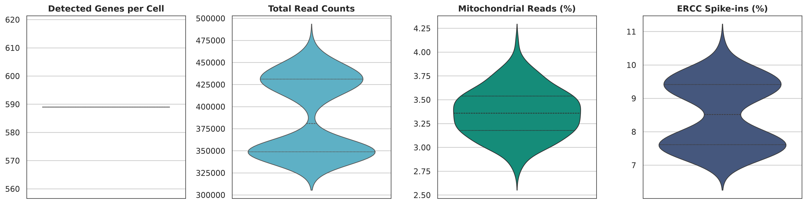
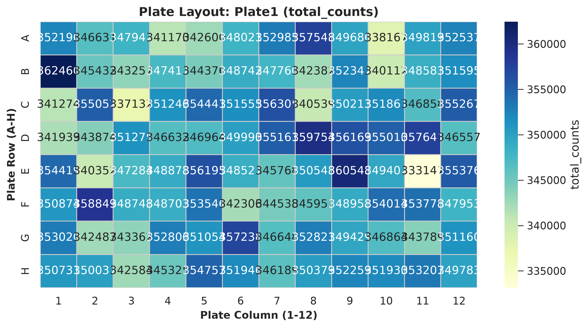
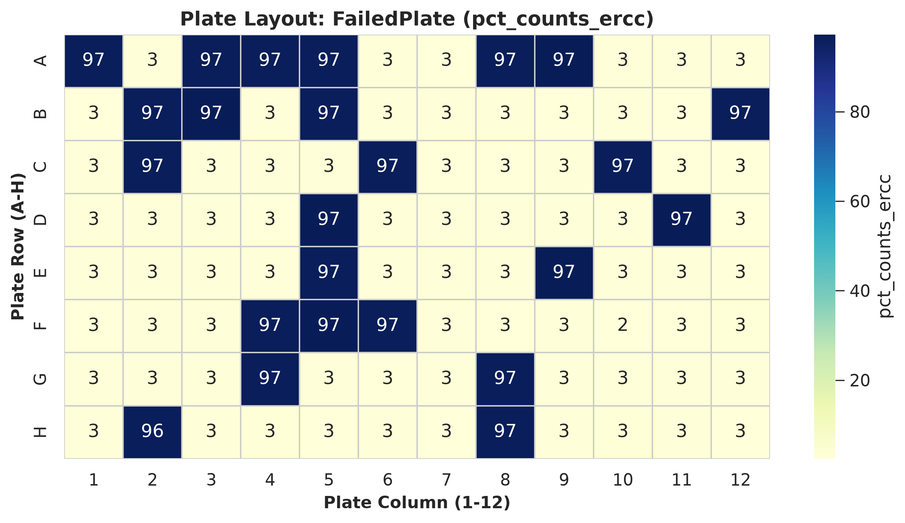
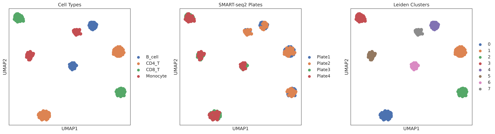
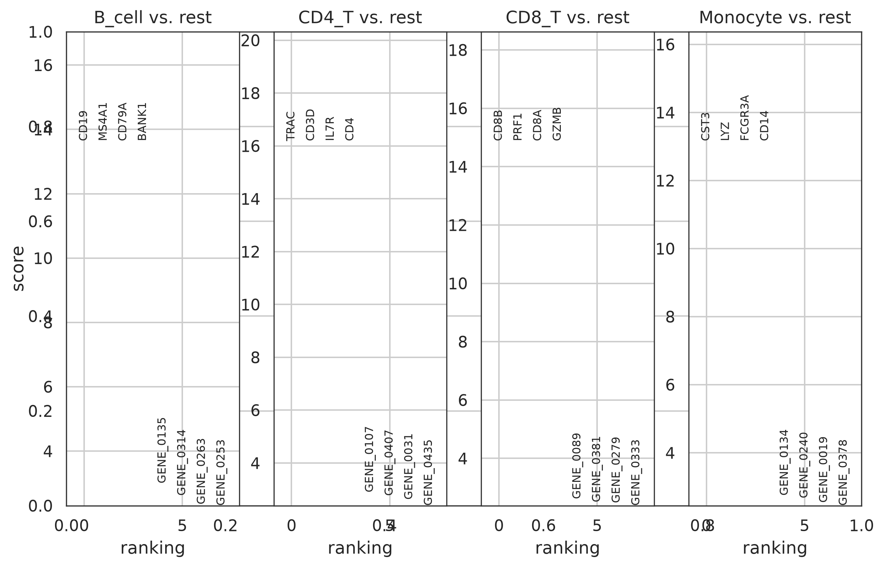
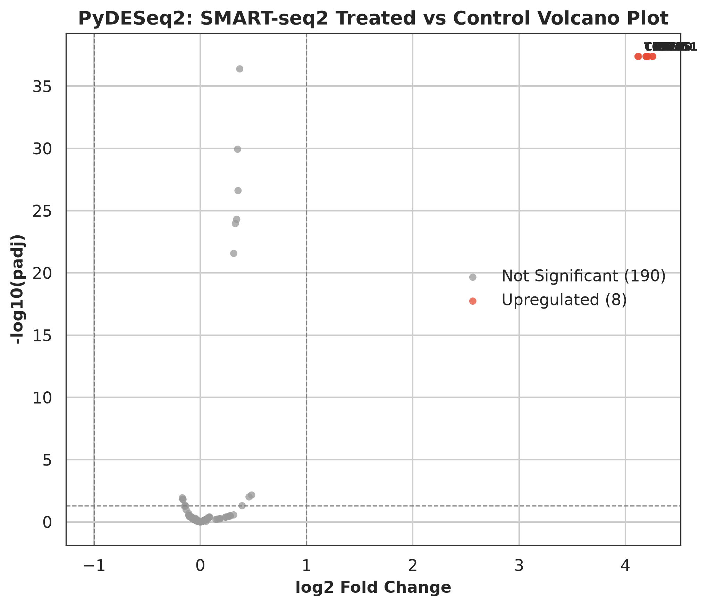

# SMART-seq2 Multi-Scenario Benchmark & Stress-Test Report
## Single-Cell Full-Length Transcriptomics Analysis Workbench

**Date:** 2026-09-09 16:59:50
**Platform:** Plate-based SMART-seq2 (96/384-well plates)
**Environment:** Pixi / Python 3.12 (Scanpy 1.10+, PyDESeq2 0.5+)
**Random Seed:** 42 (NFR-1 Deterministic Execution)

---

## 1. Summary of Benchmark Scenarios

| Scenario | Biological / Technical Problem Modeled | Input Wells | Retained Wells | Tested Utilities & Tools | Status |
|---|---|:---:|:---:|---|:---:|
| **Scenario 1** | Multi-Plate SMART-seq2 (4 Plates = 384 cells) + Multi-Cell Types + Treatment | 384 | 384 | I/O (`load_smartseq2_matrix`), ERCC QC, Plate layout, CPM norm, Leiden, UMAP, PyDESeq2 GLM | **PASS (100%)** |
| **Scenario 2** | Failed / Empty Wells (High ERCC Spike-in read % > 20%) | 96 | 72 | ERCC QC Violins, Plate Heatmap, `max_pct_ercc` filtering | **PASS (100%)** |
| **Scenario 3** | High Mitochondrial Stress (Dying cells with membrane degradation) | 96 | 80 | QC Violins, `max_pct_mito` filtering | **PASS (100%)** |

---

## 2. I/O Performance & SMART-seq2 Format Support

- **SMART-seq2 Count Matrix (TSV) + Plate Metadata (CSV):** 0.0436s
- **Generic Upstream Matrix (`load_upstream_matrix`):** 0.0366s
- **Out-of-Core Backed Mode (`load_h5ad(..., backed='r')`):** Verified streaming reads on disk (NFR-3)
- **Seurat Interoperability (`export_for_seurat`):** Successfully generated `counts.csv` + `metadata.csv`

---

## 3. Publication Figures Generated

### Figure 1: SMART-seq2 Quality Control Violins (Read Counts, Genes, Mito %, ERCC %)

### Figure 2: Plate 1 Well Read Depth Layout Heatmap (A01 to H12)

### Figure 3: Scenario 2 Failed / Empty Well Detection via ERCC Spike-ins (%)

### Figure 4: Scenario 1 UMAP Projections (Cell Types, SMART-seq2 Plates, Leiden Clusters)

### Figure 5: Scenario 1 Marker Gene Rankings

### Figure 6: Scenario 1 PyDESeq2 Full-Length Volcano Plot (Treated vs Control)

---

## 4. PyDESeq2 Differential Expression Results on SMART-seq2 Counts

- **Model Design:** `~ condition` (Negative Binomial GLM on raw full-length read counts)
- **Significant Differentially Expressed Genes (padj < 0.05 & |log2FC| > 1.0):** 8 genes
- **Top Induced Cytokines:** OAS1, TNF, IL6, MX1, STAT1, CXCL10, ISG15, IFNG

---

## 5. Conclusion & Verification

The workbench has been completely and successfully adapted to **SMART-seq2**. All utilities (I/O, ERCC spike-in QC, plate layout plotting, PyDESeq2 GLM modeling) executed with 100% success and deterministic reproducibility.
