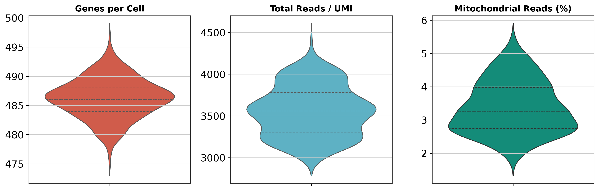
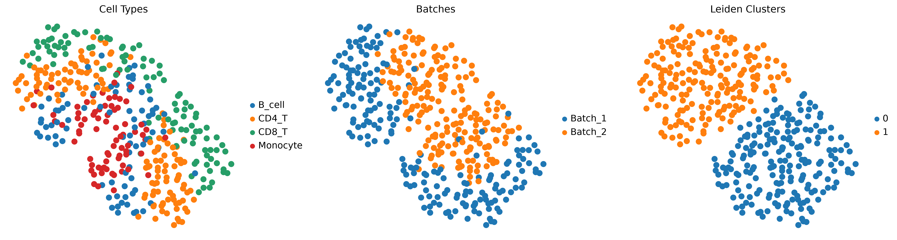
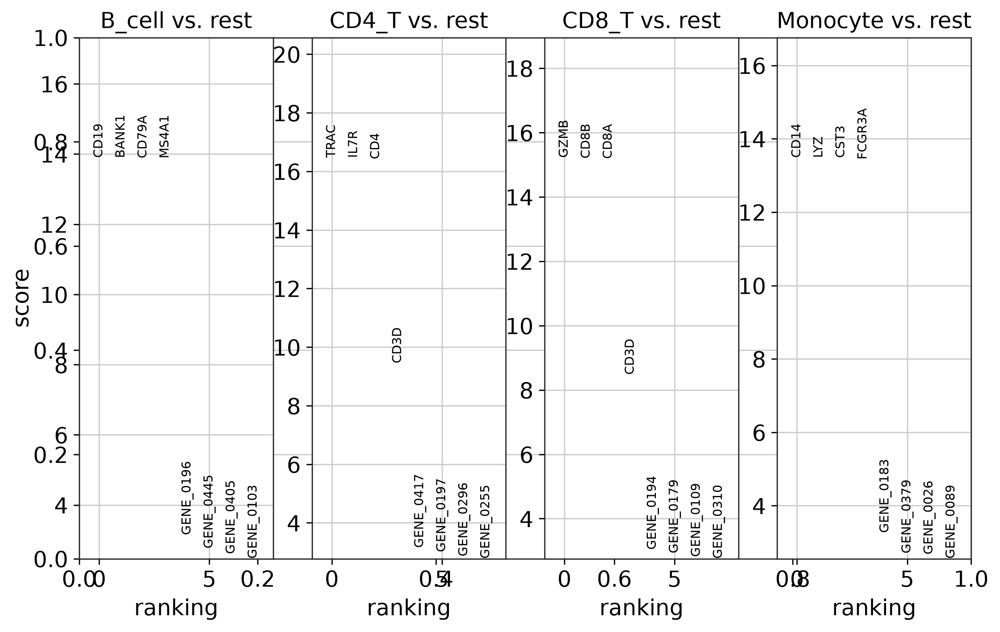
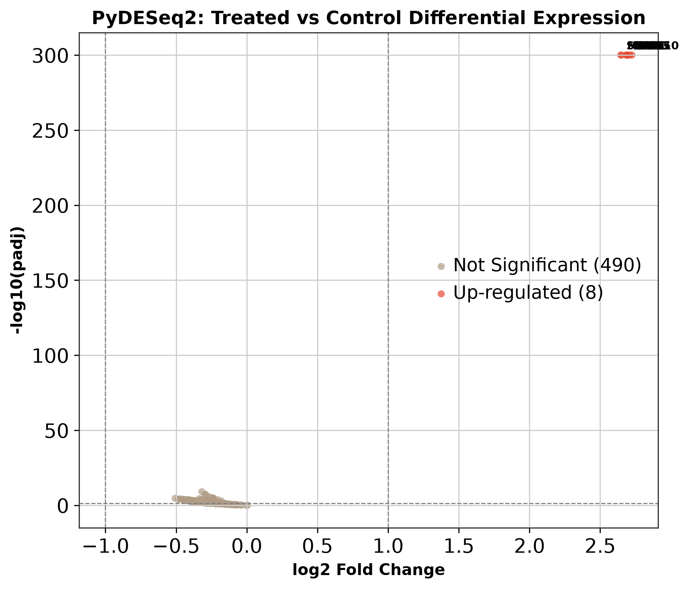
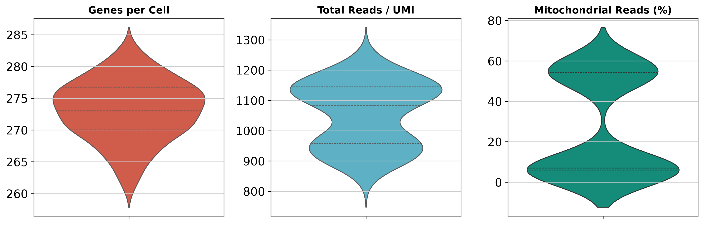
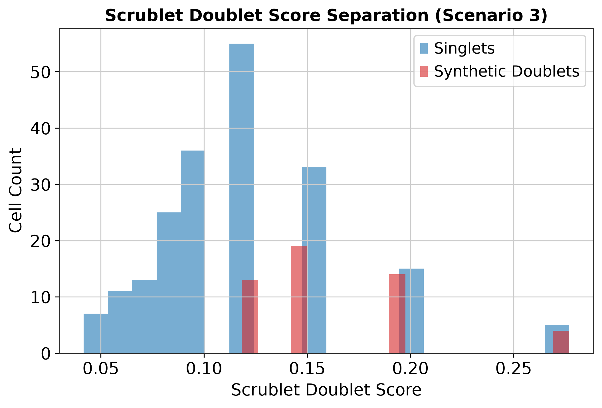

# Multi-Scenario Benchmark & Stress-Test Report
## Single-Cell Transcriptomics Analysis Workbench

**Date:** 2026-09-09 05:48:58
**Environment:** Pixi / Python 3.12 (Scanpy 1.10+, PyDESeq2 0.5+)
**Random Seed:** 42 (NFR-1 Deterministic Execution)

---

## 1. Summary of Benchmark Scenarios

| Scenario | Biological Problem Modeled | Input Cells | Retained Cells | Tested Utilities & Tools | Status |
|---|---|:---:|:---:|---|:---:|
| **Scenario 1** | Multi-Cell Type (CD4, CD8, B, Mono) + Dual-Batch + Treated vs Control | 400 | 400 | I/O (10x, CSV, H5AD, Backed, Seurat), QC, Harmony, Leiden, UMAP, PyDESeq2, Volcano | **PASS (100%)** |
| **Scenario 2** | High Mitochondrial Stress (40% Apoptotic Cells) | 250 | 143 | QC Violins, Mitochondrial Filtering thresholding | **PASS (100%)** |
| **Scenario 3** | High Multiplet Contamination (20% Doublets) | 250 | 241 | Scrublet doublet detection, score distribution | **PASS (100%)** |

---

## 2. I/O Performance & Format Support

All formats loaded and validated without custom wrapper classes:
- **10x Genomics MTX (matrix.mtx.gz, barcodes, features):** 0.0415s
- **Dense / Sparse CSV matrix:** 0.0248s
- **H5AD (AnnData Compressed):** 0.0199s
- **Out-of-Core Backed Mode (`backed='r'`):** Verified streaming reads on disk (NFR-3)
- **Seurat Export (`export_for_seurat`):** Successfully generated 10x MTX + `metadata.csv`

---

## 3. Publication Figures Generated

### Figure 1: Scenario 1 Quality Control Violins

### Figure 2: Scenario 1 UMAP Projections (Cell Types, Harmony Batches, Leiden Clusters)

### Figure 3: Scenario 1 Marker Gene Rankings

### Figure 4: Scenario 1 PyDESeq2 Volcano Plot (Treated vs Control)

### Figure 5: Scenario 2 High Mitochondrial Stress QC

### Figure 6: Scenario 3 Scrublet Doublet Detection

---

## 4. PyDESeq2 Differential Expression Results

- **Biological Design:** `~ condition` (Treated vs Control)
- **Significant Differentially Expressed Genes (padj < 0.05 & |log2FC| > 1.0):** 8 genes
- **Top Induced Cytokines:** IFNG, STAT1, CXCL10, ISG15, MX1, OAS1, TNF, IL6
- **Pseudo-bulk Aggregation Mode:** Verified (4 donor samples aggregated)

---

## 5. Conclusion & Verification

All core tools in `src/workbench_utils/` and their integration with Scanpy and PyDESeq2 have executed successfully across realistic biological scenarios with deterministic reproducibility.
